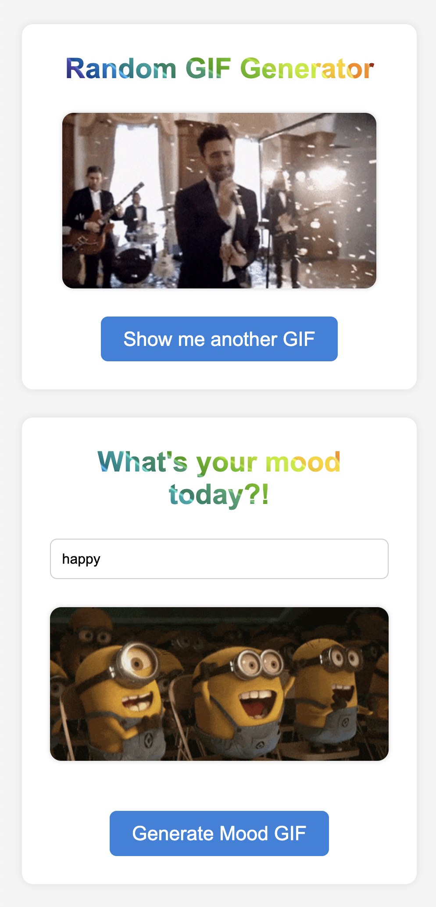

# Fetch Giphy Project

The Fetch Giphy Project is a simple web application that utilizes the Giphy API to display GIFs on a webpage. It allows users to click a button to fetch a random GIF, as well as input their current mood to fetch a relevant GIF. The project is written in JavaScript and features a fetch method to make asynchronous requests.

## Features

- Random GIF Fetching: Users can click a button to fetch and display a random GIF.
- Mood-based GIF Search: Users can input their mood into a text field, and the application fetches a GIF that matches the mood description.
- Asynchronous API Requests: Utilizes JavaScript's fetch method to make asynchronous calls to the Giphy API, ensuring the UI is responsive and efficient.
- Async/Await Syntax: Makes use of modern JavaScript async/await syntax for clear and concise handling of asynchronous operations.
- Parameterized API Requests: Incorporates dynamic query parameters in API requests to fetch data according to user input or random selection.

# Getting Started

## Prerequisites

Before setting up the Fetch Giphy Project, ensure you have Node.js and npm (Node Package Manager) installed on your machine. These will be needed to install dependencies and run the project.

## Step 1: Obtain a Giphy API Key
- Go to the [Giphy Developers](https://developers.giphy.com) site, and click the shiny blue `Get Started` button in the top right.
- Create a Giphy account. There is a link hidden after the login form, that says `Join Giphy`
- Once signed up, you should be directed to a `Dashboard`. Click `Create an App`.
- On `Step 1` of `Create an App`, choose `API` and go to the next step
- Give your app a name and description and click `Create App`
- You will now be given an API key that you can use in your Javascript when making calls to the Giphy API

## Step 2: Set Up Your Project
- Clone the repository to your local machine or download the source code.
- Open the project directory in your code editor.

## Step 3: Configure API Key
Replace API_KEY = "YOUR_API_KEY" with the API key you obtained from Giphy.

## Step 4: Install Dependencies
Open a terminal in your project directory.
Run the following command to install all necessary dependencies:

    npm install

## Step 5: Start the Application
In the same terminal, execute the following command to start the local server:

    npm run start

